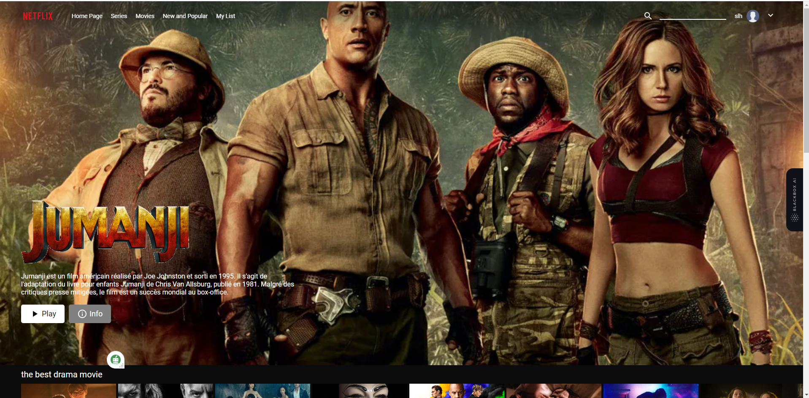

<h1 align="center">Netflix App Frontend Client Side </h1>

  

<ul>
<h3 align="center">Description</h3>
<li>A movie streaming app is a software application that allows users to watch their favorite shows on their devices with the help of the internet. These apps offer a library of movies and TV shows, which can be streamed on the end-user's demand or desire.</li>

<h3 align="center">In this  movie app, i use</h3>

<li>React js</li>
<li>Context api react </li>
<li>React-router-dom</li>
<li>React-toastify</li>
<li>React-youtube</li>
<li>Recharts</li>
<li>Axios</li>

<h3 align="center">what can i do with this app</h3>
<li>Use a real API to search for movies as we type.</li>
<li>Create a "Netflix style" horizontal scroll effect. </li>
<li>Add movies to and remove them from our favourites.</li>
<li>Save our favourites to Database to they appear when the app refreshes.</li>
</ul>